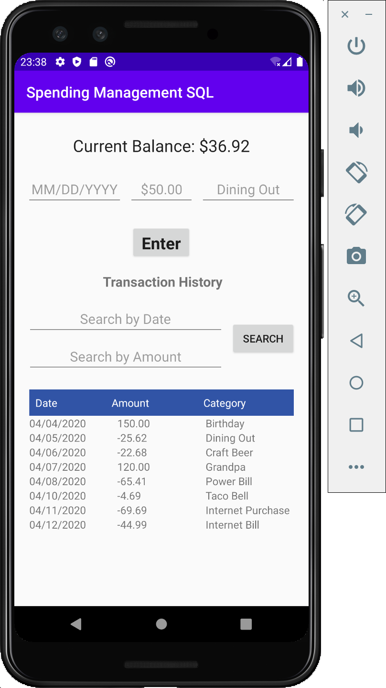

# SpendingManagementSQL
Modified version of the SpendingManagement program, this time utilizing SQLite.
## User Stories
1) As a user, I want to record that I added $150 on the 4th of April from my savings. I will first click on the date form. The system will respond by pulling up the number key pad. I will tap 04/04/2020. Next, I will click the money form. The system will respond by pulling up the number key pad. I will tap 150. Then, I will click the purpose form. The system will respond by pulling up a full keyboard. I will type "Savings." Finally, I will click the Enter button. The system will respond by updating my balance at the top of the screen to $150, and it will enter the data into the table that is displayed underneath the text box "Transaction history."

2) As a user, I want to record that I spent $25.62 on the 5th of April on dining out. I will first click on the date form. The system will respond by pulling up the number key pad. I will tap 04/05/2020. Next, I will click the money form. The system will respond by pulling up the number key pad. I will tap -25.62. Then, I will click the purpose form. The system will respond by pulling up a full keyboard. I will type "Dining Out." Finally, I will click the Enter button. The system will respond by updating my balance at the top of the screen to $124.38, and it will enter the data into the table that is displayed underneath the text box "Transaction history."

3) As a user, I want to be able to close the app and return to it later without losing my data. I will quit the app entirely and force close it. I will then reopen it. The system will respond by having all of my information already populated on the screen for me.

4) As a user, I want to be able to filter my database data. I want to search for all transactions between 04/05/2020 and 04/10/2020. I type “between 04/05/2020 and 04/10/2020” in the “Search by Date” text field, and the system responds by showing me the data between these dates.

5) As a user, I want to be able to filter my database data. I want to search for all transactions greater than $100. I type “> 100” in the “Search by Amount” text field, and the system responds by showing me all transactions greater than $100.

6) As a user, I want to be able to filter my database data. I want to search for all transactions between 04/05/2020 and 04/10/2020 while also searching for all transactions greater than $100. I type “between 04/05/2020 and 04/10/2020” in the “Search by Date” text field and “> 100” in the “Search by Amount” text field, and the system responds by showing me the data between these dates that are greater than $100.

## UI Sketches
Empty History UI sketch:

UI sketch with entries:

## Test Case Video
File is "testCases.mp4" found in the root folder.
